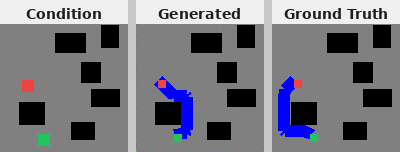
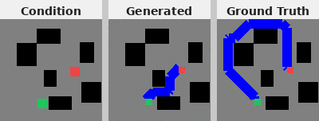
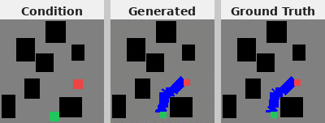

# Diffusion Model for Path Planning

An image-conditioned diffusion model that generates collision-free paths on 2D grid maps. Given a map with a start marker (green) and a goal marker (red), the model learns to generate the connecting path (blue) while avoiding obstacles.

---

## Installation & Usage

**1. Clone the repo**
```bash
git clone <repo-url>
```

**2. Enter the directory**
```bash
cd Diffusion_model_for_path_planning
```

**3. Install dependencies** (requires [uv](https://github.com/astral-sh/uv))
```bash
uv sync
source .venv/bin/activate
```

**4. Train**
```bash
python src/train.py
```

Checkpoints are saved to `src/checkpoints/<run_timestamp>/` every 25 epochs. If you are on a machine with limited GPU memory, reduce the batch size:

```bash
python src/train.py --batch-size 8
```

**5. Generate**
```bash
python src/generate.py --checkpoint <run_timestamp>
```

Omit `--checkpoint` to list available runs. Use `--num-images N` to control how many samples are generated (default: 10). Output is saved to `src/samples/<timestamp>/` as side-by-side `comparison_000.png … comparison_NNN.png` (Condition | Generated | Ground Truth).

**6. Regenerate dataset**
```bash
python data_generation/generate_data.py
```

Edit the parameters block at the top of `generate_data.py` to change grid size, number of samples, obstacle counts, etc. Output goes to `data_generation/data/`.

---

## Results

The model was trained for 75 epochs. The results below show the condition map (input), the generated path, and the ground truth side by side.

In these two examples, the model generates a valid path from the green start to the red goal while avoiding all obstacles, though the exact route differs from the ground truth:





In this example, the generated path closely matches the ground truth:



Overall, the model has learned the task: given a map, it reliably generates a path that connects the start and goal while avoiding obstacles.

---

## Extra: Web-based GUI

A Gradio web interface is included for interactive inference. Upload a condition map, adjust the number of diffusion steps and samples, and click **Generate**:

```bash
python src/app.py
```

The app loads the latest available checkpoint automatically and displays all generated path samples side by side in the browser.

If running on a remote server, the app can still be accessed from a local machine. Gradio will print a public URL in the terminal (e.g. `https://xxxxxxxxxxxx.gradio.live`) that can be opened in any browser. The link is valid for 72 hours.

---

## Difficulties & Solutions

Initially, the model failed to generate valid paths whenever the start and goal markers were far apart. It would only produce reasonable outputs when the two markers were nearly adjacent. The root cause was that standard convolutions capture only local spatial relationships, so the model struggled to relate the green and red pixels when they were distant from each other.

To address this, attention layers were added at the bottleneck and at the encoder and decoder layers immediately surrounding it. Attention allows the model to learn the relative importance of any two spatial locations regardless of distance, enabling it to connect far-apart start and goal positions. Attention was intentionally not added to every layer, since that would significantly increase computational cost. Adding it selectively at the bottleneck and the adjacent encoder/decoder layers was sufficient to resolve the issue.
